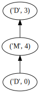
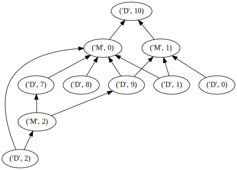

# Quickstart

## Preliminaries

### Imports


```python
import mercs
import numpy as np
from mercs.tests import load_iris, default_dataset
from mercs.core import Mercs

import pandas as pd
```

## Fit

Here a small MERCS testdrive for what I suppose you'll need. First, let us generate a basic dataset. Some utility-functions are integrated in MERCS so that goes like this


```python
train, test = default_dataset(n_features=10)

df = pd.DataFrame(train)
df.head()
```


<div>
<style scoped>
    .dataframe tbody tr th:only-of-type {
        vertical-align: middle;
    }

    .dataframe tbody tr th {
        vertical-align: top;
    }

    .dataframe thead th {
        text-align: right;
    }
</style>
<table border="1" class="dataframe">
  <thead>
    <tr style="text-align: right;">
      <th></th>
      <th>0</th>
      <th>1</th>
      <th>2</th>
      <th>3</th>
      <th>4</th>
      <th>5</th>
      <th>6</th>
      <th>7</th>
      <th>8</th>
      <th>9</th>
      <th>10</th>
    </tr>
  </thead>
  <tbody>
    <tr>
      <th>0</th>
      <td>0.675737</td>
      <td>-0.476428</td>
      <td>3.581450</td>
      <td>0.183020</td>
      <td>-1.777475</td>
      <td>0.136767</td>
      <td>1.160297</td>
      <td>0.129889</td>
      <td>1.260818</td>
      <td>-1.564195</td>
      <td>0.0</td>
    </tr>
    <tr>
      <th>1</th>
      <td>1.173828</td>
      <td>0.633868</td>
      <td>1.371909</td>
      <td>-1.326919</td>
      <td>1.293080</td>
      <td>1.524197</td>
      <td>1.310965</td>
      <td>-3.103991</td>
      <td>-0.214067</td>
      <td>1.064141</td>
      <td>1.0</td>
    </tr>
    <tr>
      <th>2</th>
      <td>-5.643059</td>
      <td>1.305686</td>
      <td>4.253110</td>
      <td>-2.597300</td>
      <td>3.752776</td>
      <td>-0.800193</td>
      <td>1.173064</td>
      <td>0.926055</td>
      <td>-3.926815</td>
      <td>-4.166201</td>
      <td>0.0</td>
    </tr>
    <tr>
      <th>3</th>
      <td>0.649619</td>
      <td>1.774041</td>
      <td>1.844340</td>
      <td>1.939269</td>
      <td>2.874112</td>
      <td>1.844517</td>
      <td>-1.189195</td>
      <td>-1.955451</td>
      <td>-3.466255</td>
      <td>3.035215</td>
      <td>1.0</td>
    </tr>
    <tr>
      <th>4</th>
      <td>-0.839893</td>
      <td>-1.723207</td>
      <td>-0.679333</td>
      <td>2.020422</td>
      <td>-1.034357</td>
      <td>0.416687</td>
      <td>1.367039</td>
      <td>0.497800</td>
      <td>-1.313362</td>
      <td>-0.440382</td>
      <td>1.0</td>
    </tr>
  </tbody>
</table>
</div>


```python
df.describe()
```


<div>
<style scoped>
    .dataframe tbody tr th:only-of-type {
        vertical-align: middle;
    }

    .dataframe tbody tr th {
        vertical-align: top;
    }

    .dataframe thead th {
        text-align: right;
    }
</style>
<table border="1" class="dataframe">
  <thead>
    <tr style="text-align: right;">
      <th></th>
      <th>0</th>
      <th>1</th>
      <th>2</th>
      <th>3</th>
      <th>4</th>
      <th>5</th>
      <th>6</th>
      <th>7</th>
      <th>8</th>
      <th>9</th>
      <th>10</th>
    </tr>
  </thead>
  <tbody>
    <tr>
      <th>count</th>
      <td>800.000000</td>
      <td>800.000000</td>
      <td>800.000000</td>
      <td>800.000000</td>
      <td>800.000000</td>
      <td>800.000000</td>
      <td>800.000000</td>
      <td>800.000000</td>
      <td>800.000000</td>
      <td>800.000000</td>
      <td>800.000000</td>
    </tr>
    <tr>
      <th>mean</th>
      <td>0.466173</td>
      <td>0.001240</td>
      <td>0.624970</td>
      <td>-0.005191</td>
      <td>0.450649</td>
      <td>0.038921</td>
      <td>-0.455200</td>
      <td>0.072851</td>
      <td>-0.472249</td>
      <td>-0.418480</td>
      <td>0.491250</td>
    </tr>
    <tr>
      <th>std</th>
      <td>2.036365</td>
      <td>2.150285</td>
      <td>2.168501</td>
      <td>2.086619</td>
      <td>1.953769</td>
      <td>2.099301</td>
      <td>2.078551</td>
      <td>2.014238</td>
      <td>1.898000</td>
      <td>2.052702</td>
      <td>0.500236</td>
    </tr>
    <tr>
      <th>min</th>
      <td>-7.455322</td>
      <td>-6.817417</td>
      <td>-6.925613</td>
      <td>-7.030162</td>
      <td>-5.708949</td>
      <td>-6.865339</td>
      <td>-7.238353</td>
      <td>-6.184692</td>
      <td>-6.159434</td>
      <td>-8.705917</td>
      <td>0.000000</td>
    </tr>
    <tr>
      <th>25%</th>
      <td>-0.954399</td>
      <td>-1.509110</td>
      <td>-0.816581</td>
      <td>-1.380624</td>
      <td>-0.691509</td>
      <td>-1.329481</td>
      <td>-1.756418</td>
      <td>-1.224983</td>
      <td>-1.703273</td>
      <td>-1.797529</td>
      <td>0.000000</td>
    </tr>
    <tr>
      <th>50%</th>
      <td>0.451760</td>
      <td>0.075555</td>
      <td>0.674027</td>
      <td>0.118554</td>
      <td>0.547505</td>
      <td>0.108292</td>
      <td>-0.493528</td>
      <td>0.174550</td>
      <td>-0.568166</td>
      <td>-0.292757</td>
      <td>0.000000</td>
    </tr>
    <tr>
      <th>75%</th>
      <td>1.847537</td>
      <td>1.384226</td>
      <td>2.148864</td>
      <td>1.398455</td>
      <td>1.820179</td>
      <td>1.454181</td>
      <td>0.836809</td>
      <td>1.497582</td>
      <td>0.712452</td>
      <td>1.053721</td>
      <td>1.000000</td>
    </tr>
    <tr>
      <th>max</th>
      <td>6.365330</td>
      <td>7.601766</td>
      <td>6.390253</td>
      <td>8.237993</td>
      <td>7.501492</td>
      <td>7.021821</td>
      <td>6.489389</td>
      <td>6.832418</td>
      <td>6.903293</td>
      <td>5.101133</td>
      <td>1.000000</td>
    </tr>
  </tbody>
</table>
</div>


Now let's train a MERCS model. To know what options you have, come talk to me or dig in the code. For induction, `nb_targets` and `nb_iterations` matter most. Number of targets speaks for itself, number of iterations manages the amount of trees _for each target_. With `n_jobs` you can do multi-core learning (with joblib, really basic, but works fine on single machine), that makes stuff faster. `fraction_missing` sets the amount of attributes that is missing for a tree. However, this parameter only has an effect if you use the `random` selection algorithm. The alternative is the `base` algorithm, which selects targets, and uses all the rest as input.


```python
clf = Mercs(
    max_depth=4,
    selection_algorithm="random",
    fraction_missing=0.6,
    nb_targets=2,
    nb_iterations=2,
    n_jobs=8,
    verbose=1,
    inference_algorithm="dask",
    max_steps=8,
    prediction_algorithm="it",
)
```

You have to specify the nominal attributes yourself. This determines whether a regressor or a classifier is learned for that target. MERCS takes care of grouping targets such that no mixed sets are created.


```python
nominal_ids = {train.shape[1]-1}
nominal_ids
```


    {10}


```python
clf.fit(train, nominal_attributes=nominal_ids)
```

    /cw/dtaijupiter/NoCsBack/dtai/elia/mercs/src/mercs/algo/induction.py:191: UserWarning: Training is being parallellized using Joblib. Number of jobs = 8
      warnings.warn(msg)
    [Parallel(n_jobs=8)]: Using backend LokyBackend with 8 concurrent workers.
    [Parallel(n_jobs=8)]: Done  10 out of  12 | elapsed:    2.3s remaining:    0.5s
    [Parallel(n_jobs=8)]: Done  12 out of  12 | elapsed:    2.3s finished
    /cw/dtaijupiter/NoCsBack/dtai/elia/miniconda/envs/rwrf/lib/python3.7/site-packages/sklearn/metrics/classification.py:1437: UndefinedMetricWarning: F-score is ill-defined and being set to 0.0 in labels with no predicted samples.
      'precision', 'predicted', average, warn_for)


So, now we have learned trees with two targets, but only a single target was nominal. If MERCS worked well, it should have learned single-target classifiers (for attribute 4) and multi-target regressors for all other target sets.


```python
for idx, m in enumerate(clf.m_list):
    msg = """
    Model with index: {}
    {}
    """.format(idx, m.model)
    print(msg)
```

    
        Model with index: 0
        DecisionTreeClassifier(class_weight=None, criterion='gini', max_depth=4,
                           max_features=None, max_leaf_nodes=None,
                           min_impurity_decrease=0.0, min_impurity_split=None,
                           min_samples_leaf=1, min_samples_split=2,
                           min_weight_fraction_leaf=0.0, presort=False,
                           random_state=121958, splitter='best')
        
    
        Model with index: 1
        DecisionTreeClassifier(class_weight=None, criterion='gini', max_depth=4,
                           max_features=None, max_leaf_nodes=None,
                           min_impurity_decrease=0.0, min_impurity_split=None,
                           min_samples_leaf=1, min_samples_split=2,
                           min_weight_fraction_leaf=0.0, presort=False,
                           random_state=671155, splitter='best')
        
    
        Model with index: 2
        DecisionTreeRegressor(criterion='mse', max_depth=4, max_features=None,
                          max_leaf_nodes=None, min_impurity_decrease=0.0,
                          min_impurity_split=None, min_samples_leaf=1,
                          min_samples_split=2, min_weight_fraction_leaf=0.0,
                          presort=False, random_state=131932, splitter='best')
        
    
        Model with index: 3
        DecisionTreeRegressor(criterion='mse', max_depth=4, max_features=None,
                          max_leaf_nodes=None, min_impurity_decrease=0.0,
                          min_impurity_split=None, min_samples_leaf=1,
                          min_samples_split=2, min_weight_fraction_leaf=0.0,
                          presort=False, random_state=365838, splitter='best')
        
    
        Model with index: 4
        DecisionTreeRegressor(criterion='mse', max_depth=4, max_features=None,
                          max_leaf_nodes=None, min_impurity_decrease=0.0,
                          min_impurity_split=None, min_samples_leaf=1,
                          min_samples_split=2, min_weight_fraction_leaf=0.0,
                          presort=False, random_state=259178, splitter='best')
        
    
        Model with index: 5
        DecisionTreeRegressor(criterion='mse', max_depth=4, max_features=None,
                          max_leaf_nodes=None, min_impurity_decrease=0.0,
                          min_impurity_split=None, min_samples_leaf=1,
                          min_samples_split=2, min_weight_fraction_leaf=0.0,
                          presort=False, random_state=644167, splitter='best')
        
    
        Model with index: 6
        DecisionTreeRegressor(criterion='mse', max_depth=4, max_features=None,
                          max_leaf_nodes=None, min_impurity_decrease=0.0,
                          min_impurity_split=None, min_samples_leaf=1,
                          min_samples_split=2, min_weight_fraction_leaf=0.0,
                          presort=False, random_state=110268, splitter='best')
        
    
        Model with index: 7
        DecisionTreeRegressor(criterion='mse', max_depth=4, max_features=None,
                          max_leaf_nodes=None, min_impurity_decrease=0.0,
                          min_impurity_split=None, min_samples_leaf=1,
                          min_samples_split=2, min_weight_fraction_leaf=0.0,
                          presort=False, random_state=732180, splitter='best')
        
    
        Model with index: 8
        DecisionTreeRegressor(criterion='mse', max_depth=4, max_features=None,
                          max_leaf_nodes=None, min_impurity_decrease=0.0,
                          min_impurity_split=None, min_samples_leaf=1,
                          min_samples_split=2, min_weight_fraction_leaf=0.0,
                          presort=False, random_state=54886, splitter='best')
        
    
        Model with index: 9
        DecisionTreeRegressor(criterion='mse', max_depth=4, max_features=None,
                          max_leaf_nodes=None, min_impurity_decrease=0.0,
                          min_impurity_split=None, min_samples_leaf=1,
                          min_samples_split=2, min_weight_fraction_leaf=0.0,
                          presort=False, random_state=137337, splitter='best')
        
    
        Model with index: 10
        DecisionTreeRegressor(criterion='mse', max_depth=4, max_features=None,
                          max_leaf_nodes=None, min_impurity_decrease=0.0,
                          min_impurity_split=None, min_samples_leaf=1,
                          min_samples_split=2, min_weight_fraction_leaf=0.0,
                          presort=False, random_state=999890, splitter='best')
        
    
        Model with index: 11
        DecisionTreeRegressor(criterion='mse', max_depth=4, max_features=None,
                          max_leaf_nodes=None, min_impurity_decrease=0.0,
                          min_impurity_split=None, min_samples_leaf=1,
                          min_samples_split=2, min_weight_fraction_leaf=0.0,
                          presort=False, random_state=521430, splitter='best')
        


So, that looks good already. Let's examine up close.


```python
clf.m_codes
```


    array([[-1,  0,  0, -1, -1, -1, -1,  0,  0,  0,  1],
           [ 0,  0, -1, -1, -1, -1, -1, -1, -1,  0,  1],
           [-1, -1,  0, -1, -1, -1, -1,  1, -1,  1, -1],
           [-1, -1, -1,  1,  1,  0,  0, -1,  0, -1, -1],
           [-1,  1,  1, -1,  0, -1, -1, -1, -1,  0, -1],
           [ 0,  0, -1, -1,  0,  1,  0,  0,  1, -1, -1],
           [ 1,  0, -1, -1, -1, -1,  1,  0,  0, -1, -1],
           [-1,  1,  1, -1, -1, -1, -1,  0,  0,  0,  0],
           [ 0, -1,  0, -1,  0,  1, -1, -1, -1,  1,  0],
           [ 1, -1, -1, -1, -1, -1,  1,  0, -1, -1,  0],
           [-1,  0,  0, -1,  1, -1, -1, -1,  1, -1, -1],
           [-1,  0, -1,  1, -1,  0, -1,  1,  0, -1,  0]])


That's the matrix that summarizes everything. This can be dense to parse, and there's alternatives to gain insights, for instance;


```python
for m_idx, m in enumerate(clf.m_list):
    msg = """
    Tree with id:          {}
    has source attributes: {}
    has target attributes: {},
    and predicts {} attributes
    """.format(m_idx, m.desc_ids, m.targ_ids, m.out_kind)
    print(msg)
```

    
        Tree with id:          0
        has source attributes: [1, 2, 7, 8, 9]
        has target attributes: [10],
        and predicts nominal attributes
        
    
        Tree with id:          1
        has source attributes: [0, 1, 9]
        has target attributes: [10],
        and predicts nominal attributes
        
    
        Tree with id:          2
        has source attributes: [2]
        has target attributes: [7, 9],
        and predicts numeric attributes
        
    
        Tree with id:          3
        has source attributes: [5, 6, 8]
        has target attributes: [3, 4],
        and predicts numeric attributes
        
    
        Tree with id:          4
        has source attributes: [4, 9]
        has target attributes: [1, 2],
        and predicts numeric attributes
        
    
        Tree with id:          5
        has source attributes: [0, 1, 4, 6, 7]
        has target attributes: [5, 8],
        and predicts numeric attributes
        
    
        Tree with id:          6
        has source attributes: [1, 7, 8]
        has target attributes: [0, 6],
        and predicts numeric attributes
        
    
        Tree with id:          7
        has source attributes: [7, 8, 9, 10]
        has target attributes: [1, 2],
        and predicts numeric attributes
        
    
        Tree with id:          8
        has source attributes: [0, 2, 4, 10]
        has target attributes: [5, 9],
        and predicts numeric attributes
        
    
        Tree with id:          9
        has source attributes: [7, 10]
        has target attributes: [0, 6],
        and predicts numeric attributes
        
    
        Tree with id:          10
        has source attributes: [1, 2]
        has target attributes: [4, 8],
        and predicts numeric attributes
        
    
        Tree with id:          11
        has source attributes: [1, 5, 8, 10]
        has target attributes: [3, 7],
        and predicts numeric attributes
        


And that concludes my quick tour of how to fit with MERCS.

## Prediction

First, we generate a query.


```python
# Single target
q_code=np.zeros(clf.m_codes[0].shape[0], dtype=int)
q_code[-1:] = 1
print("Query code is: {}".format(q_code))

y_pred = clf.predict(test, q_code=q_code)
y_pred[:10]
```

    Query code is: [0 0 0 0 0 0 0 0 0 0 1]


    array([1., 0., 0., 0., 1., 0., 0., 1., 0., 0.])


```python
clf.show_q_diagram()
```





```python
# Multi-target
q_code=np.zeros(clf.m_codes[0].shape[0], dtype=int)
q_code[-2:] = 1
print("Query code is: {}".format(q_code))

y_pred = clf.predict(test, q_code=q_code)
y_pred[:10]
```

    Query code is: [0 0 0 0 0 0 0 0 0 1 1]


    array([[ 0.8987434 ,  1.        ],
           [-0.35476461,  0.        ],
           [-0.35476461,  1.        ],
           [-0.35476461,  0.        ],
           [-0.6409689 ,  1.        ],
           [-0.6409689 ,  1.        ],
           [-1.70072951,  0.        ],
           [-0.35476461,  1.        ],
           [-0.6409689 ,  1.        ],
           [-0.35476461,  0.        ]])


```python
clf.show_q_diagram()
```





```python
# Missing attributes
q_code=np.zeros(clf.m_codes[0].shape[0], dtype=int)
q_code[-1:] = 1
q_code[:1] = -1
print("Query code is: {}".format(q_code))

y_pred = clf.predict(test, q_code=q_code)
y_pred[:10]
```

    Query code is: [-1  0  0  0  0  0  0  0  0  0  1]


    array([1., 0., 0., 0., 1., 0., 0., 1., 0., 0.])


```python
clf.show_q_diagram()
```


